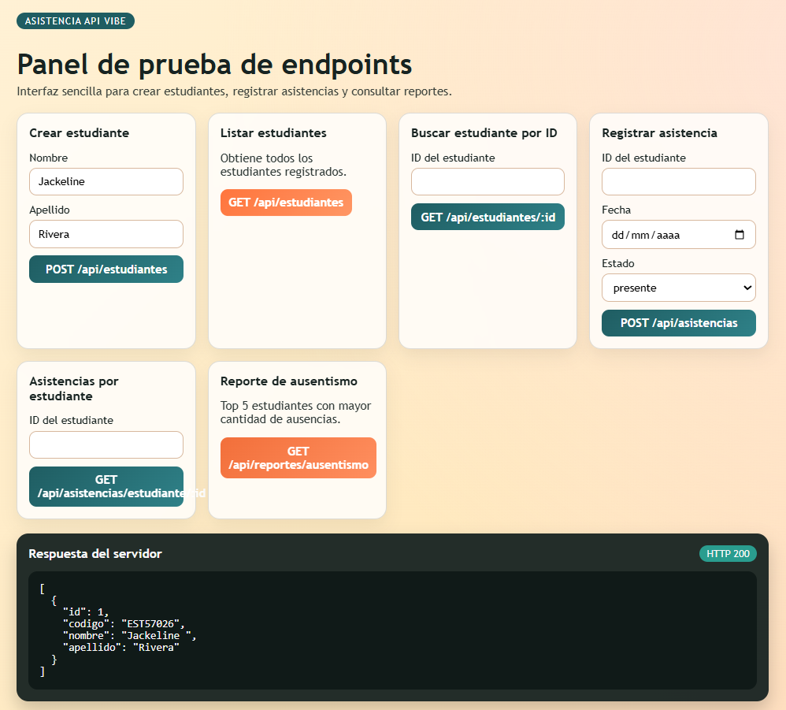
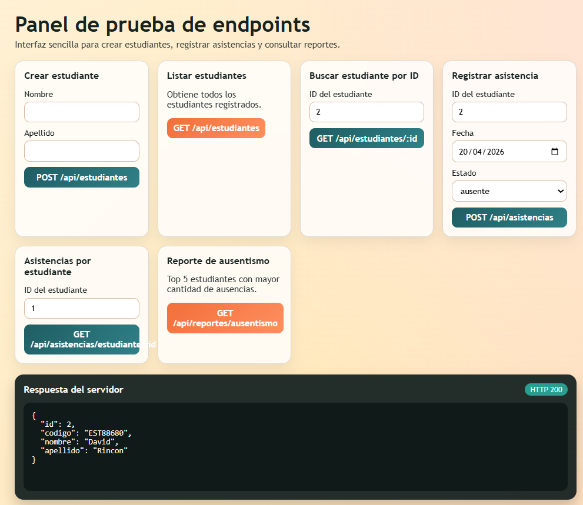
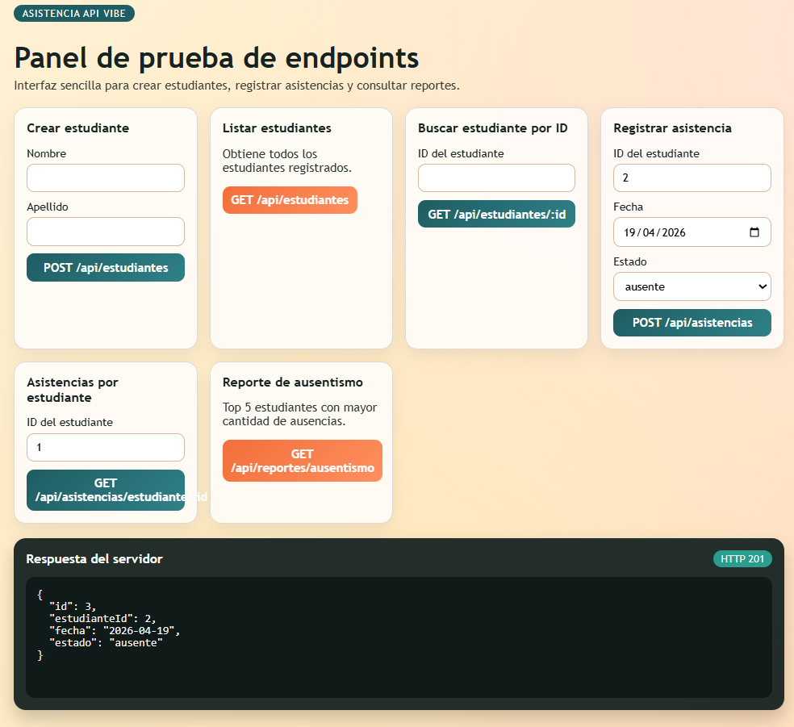
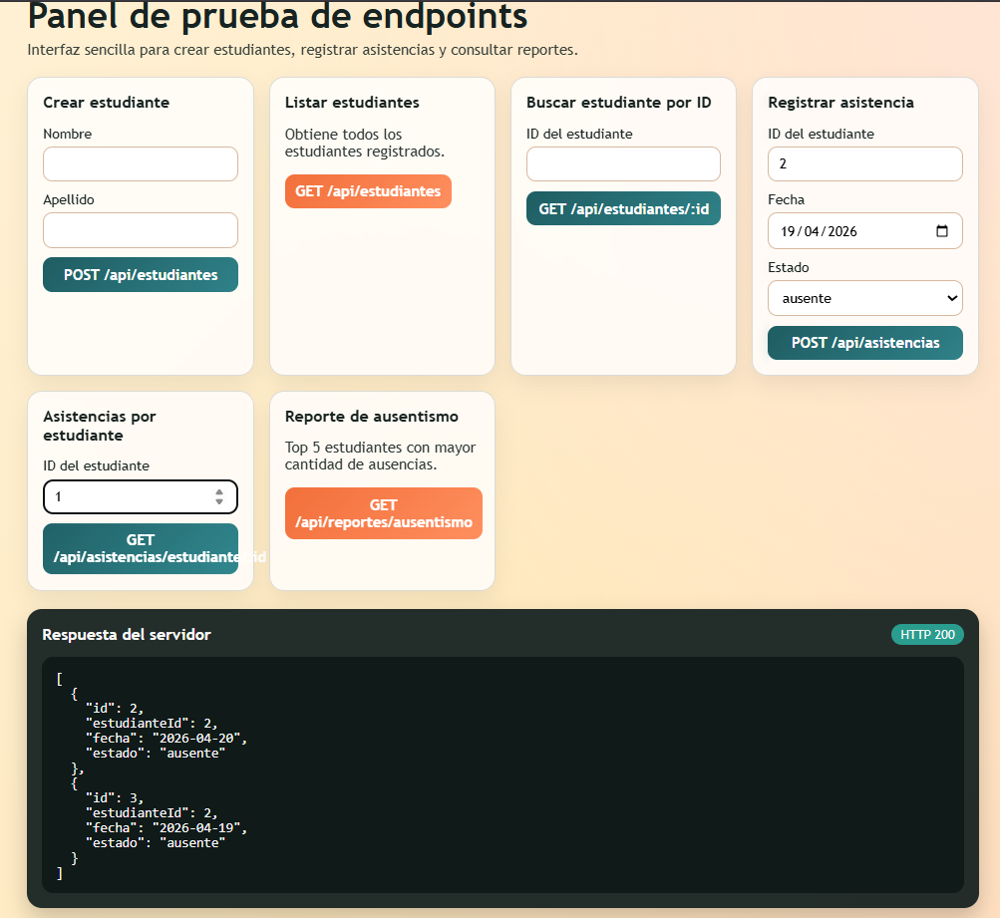
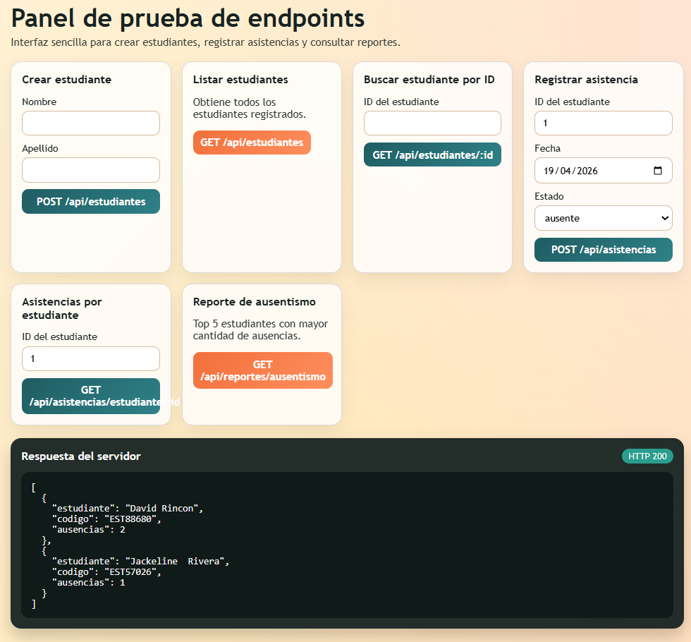

POST /api/estudiantes

GET /api/estudiantes

GET /api/estudiantes/:id     
                    

POST /api/asistencias  

GET /api/asistencias/estudiante/:id

GET /api/reportes/ausentismo
       

